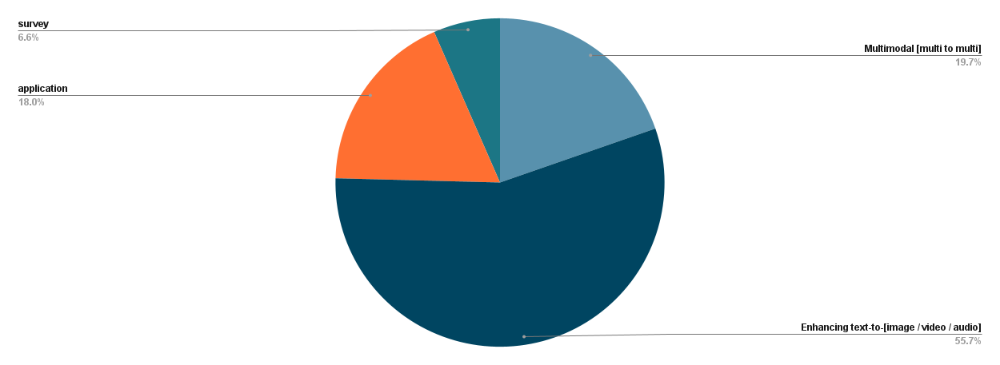

# Connecting LLMs to Diffusion Models: a comprehensive survey on exploring the boundaries of Generative AI
Collection of recent Connecting LLMs to Diffusion Models. Questions and discussions are most welcome! Upcoming works will be updated on a regular basis, feel free to contact me to add... :thumbsup:

## Papers and Codes

### Enhancing text-to-image  
* `ACM2023` SUR-adapter: Enhancing Text-to-Image Pre-training Models with Scene Understanding and Relevance [[Paper]](https://dl.acm.org/doi/abs/10.1145/3581783.3611863?casa_token=kRXdyR2G7E8AAAAA:JO88tieqD8S2gVzNdnBPN7DeHK7SS8j6TCHivdNu4mkQC1yfAtXgbUtL1ZGERePNJT6jjpruGYBgGw) [[Code]](https://github.com/Qrange-group/SUR-adapter) 
* `Arxiv2023` LLM as an Art Director (LaDi): Using LLMs to improve Text-to-Media Generators [[Paper]](https://arxiv.org/abs/2311.03716)
* `WACV2024` MotionGPT: Human Motion Synthesis With Improved Diversity and Realism via GPT-3 Prompting [[Paper]](https://openaccess.thecvf.com/content/WACV2024/html/Ribeiro-Gomes_MotionGPT_Human_Motion_Synthesis_With_Improved_Diversity_and_Realism_via_WACV_2024_paper.html) [[Code]](https://github.com/humansensinglab/MotionGPT)
* `Arxiv2023` De-Diffusion Makes Text a Strong Cross-Modal Interface [[Paper]](https://arxiv.org/abs/2311.00618)
* `Findings of ACL2023` Complex Event Schema Induction with Knowledge-Enriched Diffusion Model [[Paper]](https://openreview.net/forum?id=in5xvBrMHv) [[Code]](https://github.com/hypasd-art/KDM)
* `Arxiv2023` Understanding (Un) Intended Memorization in Text-to-Image Generative Models [[Paper]](https://arxiv.org/abs/2312.07550)
* `NeurIPS2023` Free-bloom: Zero-shot text-to-video generator with llm director and ldm animator [[Paper]](https://proceedings.neurips.cc/paper_files/paper/2023/hash/52f050499cf82fa8efb588e263f6f3a7-Abstract-Conference.html) [[Code]](https://github.com/soolab/free-bloom)
* `Arxiv2023` Generative AI Beyond LLMs: System Implications of Multi-Modal Generation [[Paper]](https://arxiv.org/abs/2312.14385)
* `Arxiv2023` DeTiME: Diffusion-Enhanced Topic Modeling using Encoder-decoder based LLM [[Paper]](https://arxiv.org/abs/2310.15296)
* `Arxiv2023` LLM Blueprint: Enabling Text-to-Image Generation with Complex and Detailed Prompts [[Paper]](https://arxiv.org/abs/2310.10640) [[Code]](https://github.com/hananshafi/llmblueprint)
* `Arxiv2024` Generative AI Meets Semantic Communication [[Paper]](https://arxiv.org/abs/2401.06803)
* `Arxiv2023` Interactive Data Synthesis for Systematic Vision Adaptation via LLMs-AIGCs Collaboration [[Paper]](https://arxiv.org/abs/2305.12799) [[Code]](https://github.com/yuqifan1117/labal-anything-pipeline)
* `Arxiv2023` Knowledge-Aware Artifact Image Synthesis with LLM-Enhanced Prompting and Multi-Source Supervision [[Paper]](https://arxiv.org/abs/2312.08056) [[Code]](https://github.com/danielwusg/artifact_diffusion)
* `Arxiv2023` Paragraph-to-Image Generation with Information-Enriched Diffusion Model [[Paper]](https://arxiv.org/abs/2311.14284) [[Code]](https://github.com/weijiawu/paradiffusion)
* `Arxiv2024` The Stronger the Diffusion Model, the Easier the Backdoor: Data Poisoning to Induce Copyright Breaches Without Adjusting Finetuning Pipeline [[Paper]](https://arxiv.org/abs/2401.04136) [[Code]](https://github.com/haonan3/SilentBadDiffusion)
* `Arxiv2023` Multimodal Procedural Planning via Dual Text-Image Prompting [[Paper]](https://arxiv.org/abs/2305.01795) [[Code]](https://github.com/YujieLu10/TIP)
* `ACM2023` LayoutLLM-T2I: Eliciting Layout Guidance from LLM for Text-to-Image Generation [[Paper]](https://dl.acm.org/doi/abs/10.1145/3581783.3612012) [[Code]](https://github.com/LayoutLLM-T2I/LayoutLLM-T2I)
* `Arxiv2023` DataInf: Efficiently Estimating Data Influence in LoRA-tuned LLMs and Diffusion Models [[Paper]](https://arxiv.org/abs/2310.00902) [[Code]](https://github.com/ykwon0407/datainf)
* `NeurIPS2023` VideoDrafter: Content-Consistent Multi-Scene Video Generation with LLM [[Paper]](https://proceedings.neurips.cc/paper_files/paper/2023/hash/2d52879ef2ba487445ca2e143b104c3b-Abstract-Conference.html) [[Code]](https://github.com/mingyuan-zhang/FineMoGen)
* `ACM2023` Text-to-Audio Generation using Instruction Guided Latent Diffusion Model [[Paper]](https://dl.acm.org/doi/abs/10.1145/3581783.3612348?casa_token=M76uv3Ay9-4AAAAA:f108JSLdL3miTt3lqutIbJhgh8h9t9eVVk3BoLQZelHTocJD3ZLiB5zSNCOTT3VaiFWwaCoa4-Brsw) [[Code]](https://github.com/declare-lab/tango)
*  `Arxiv2023` I Spy a Metaphor: Large Language Models and Diffusion Models Co-Create Visual Metaphors [[Paper]](https://arxiv.org/abs/2305.14724) [[Code]](https://github.com/tuhinjubcse/VisualMetaphors)
* `IEEE2024` Mitigate Replication and Copying in Diffusion Models with Generalized Caption and Dual Fusion Enhancement [[Paper]](https://ieeexplore.ieee.org/abstract/document/10446820/) [[Code]](https://github.com/HowardLi0816/dual-fusion-diffusion)
* `Arxiv2023` Muse: Text-To-Image Generation via Masked Generative Transformers [[Paper]](https://arxiv.org/abs/2301.00704) [[Code]](https://github.com/lucidrains/muse-maskgit-pytorch)
* `Arxiv2023` Zero-shot Generation of Coherent Storybook from Plain Text Story using Diffusion Models [[Paper]](https://arxiv.org/abs/2302.03900)
* `Arxiv2023` ChatGPT is on the Horizon: Could a Large Language Model be Suitable for Intelligent Traffic Safety Research and Applications? [[Paper]](https://arxiv.org/abs/2303.05382)
* `Arxiv2023` T3Bench: Benchmarking Current Progress in Text-to-3D Generation [[Paper]](https://arxiv.org/abs/2310.02977) [[Code]](https://github.com/THU-LYJ-Lab/T3Bench)
* `Arxiv2023` StoryGPT-V: Large Language Models as Consistent Story Visualizers [[Paper]](https://arxiv.org/abs/2312.02252) [[Code]](https://github.com/xiaoqian-shen/StoryGPT-V)
* `Arxiv2023` User-Centric Interactive AI for Distributed Diffusion Model-based AI-Generated Content [[Paper]](https://arxiv.org/abs/2311.11094)
* `Arxiv2023` CommonCanvas: An Open Diffusion Model Trained with Creative-Commons Images [[Paper]](https://arxiv.org/abs/2310.16825) [[Code]](https://github.com/mosaicml/diffusion/blob/main/assets/common-canvas.md)
* `Arxiv2023` DUAW: Data-free Universal Adversarial Watermark against Stable Diffusion Customization [[Paper]](https://arxiv.org/abs/2308.09889)
* `Arxiv2023` InstructCV: Instruction-Tuned Text-to-Image Diffusion Models as Vision Generalists [[Paper]](https://arxiv.org/abs/2310.00390) [[Code]](https://github.com/AlaaLab/InstructCV)
* `AAAI2023` Text-to-Image Generation for Abstract Concepts [[Paper]](https://ojs.aaai.org/index.php/AAAI/article/view/28122)
* `AAAI2023` ORES: Open-vocabulary Responsible Visual Synthesis [[Paper]](https://ojs.aaai.org/index.php/AAAI/article/view/30144) [[Code]](https://github.com/kodenii/ores)
* `NeurIPS2023` FineMoGen: Fine-Grained Spatio-Temporal Motion Generation and Editing [[Paper]](https://proceedings.neurips.cc/paper_files/paper/2023/hash/2d52879ef2ba487445ca2e143b104c3b-Abstract-Conference.html) [[Code]](https://github.com/mingyuan-zhang/FineMoGen)
* `Arxiv2023` X-IQE: eXplainable Image Quality Evaluation for Text-to-Image Generation with Visual Large Language Models [[Paper]](https://arxiv.org/abs/2305.10843) [[Code]](https://github.com/Schuture/Benchmarking-Awesome-Diffusion-Models)
* `Arxiv2023` EvalCrafter: Benchmarking and Evaluating Large Video Generation Models [[Paper]](https://arxiv.org/abs/2310.11440) [[Code]](https://github.com/EvalCrafter/EvalCrafter)
* `Arxiv2023` DAVIDSONIAN SCENE GRAPH: IMPROVING RELIABILITY IN FINE-GRAINED EVALUATION FOR TEXT-TO-IMAGE GENERATION [[Paper]](https://arxiv.org/abs/2310.18235) [[Code]](https://github.com/j-min/DSG)
* `Arxiv2023` LLM-grounded Diffusion: Enhancing Prompt Understanding of Text-to-Image Diffusion Models with Large Language Models [[Paper]](https://arxiv.org/abs/2305.13655) [[Code]](https://github.com/TonyLianLong/LLM-groundedDiffusion)
* `Arxiv2023` DiagrammerGPT: Generating Open-Domain, Open-Platform Diagrams via LLM Planning [[Paper]](https://arxiv.org/abs/2310.12128) [[Code]](https://github.com/aszala/DiagrammerGPT)
* `Arxiv2023` Mini-DALLE3: Interactive Text to Image by Prompting Large Language Models [[Paper]](https://arxiv.org/abs/2310.07653) [[Code]](https://github.com/Zeqiang-Lai/Mini-DALLE3)
* `Arxiv2024` DiffusionGPT: LLM-Driven Text-to-Image Generation System [[Paper]](https://arxiv.org/abs/2401.10061) [[Code]](https://github.com/DiffusionGPT/DiffusionGPT)
* `Arxiv2024` Memory-Efficient Personalization using Quantized Diffusion Model [[Paper]](https://arxiv.org/abs/2401.04339)
* `Arxiv2024` Vlogger: Make Your Dream A Vlog [[Paper]](https://arxiv.org/abs/2401.09414) [[Code]](https://github.com/Vchitect/Vlogger)
* `Arxiv2024` Auffusion: Leveraging the Power of Diffusion and Large Language Models for Text-to-Audio Generation [[Paper]](https://arxiv.org/abs/2401.01044) [[Code]](https://github.com/happylittlecat2333/Auffusion)
* `Arxiv2024` ELLA: Equip Diffusion Models with LLM for Enhanced Semantic Alignment [[Paper]](https://arxiv.org/abs/2403.05135) [[Code]](https://github.com/TencentQQGYLab/ELLA)
### Multimodal Input to Multimodal Output
* `Arxiv2023` NExT-GPT: Any-to-Any Multimodal LLM [[Paper]](https://arxiv.org/abs/2309.05519) [[Code]](https://github.com/NExT-GPT/NExT-GPT)
* `Arxiv2023` De-Diffusion Makes Text a Strong Cross-Modal Interface [[Paper]](https://arxiv.org/abs/2311.00618)
* `Arxiv2023` Imagebind-llm: Multi-modality instruction tuning [[Paper]](https://arxiv.org/abs/2309.03905) [[Code]](https://github.com/OpenGVLab/LLaMA-Adapter)
* `Arxiv2023` VL-GPT: A Generative Pre-trained Transformer for Vision and Language Understanding and Generation [[Paper]](https://arxiv.org/abs/2312.09251) [[Code]](https://github.com/ailab-cvc/vl-gpt)
* `Arxiv2023` Modality Plug-and-Play: Elastic Modality Adaptation in Multimodal LLMs for Embodied AI [[Paper]](https://arxiv.org/abs/2312.07886) [[Code]](https://github.com/pittisl/mpnp-llm)
* `AAAI2023` Visual adversarial examples jailbreak aligned large language models [[Paper]](https://ojs.aaai.org/index.php/AAAI/article/view/30150)
* `International Journal of Oral Science 2023` ChatGPT for shaping the future of dentistry: the potential of multi-modal large language model [[Paper]](https://www.nature.com/articles/s41368-023-00239-y)
* `Arxiv2023` Large AI Model Empowered Multimodal Semantic Communications [[Paper]](https://arxiv.org/abs/2309.01249)
* `International Conference on Applications of Natural Language to Information Systems 2023` How Shall a Machine Call a Thing? [[Paper]](https://link.springer.com/chapter/10.1007/978-3-031-35320-8_41) [[Code]](https://github.com/federicotorrielli/stableKnowledge)
* `Arxiv2023` MINIGPT-5: INTERLEAVED VISION-AND-LANGUAGE GENERATION VIA GENERATIVE VOKENS [[Paper]](https://arxiv.org/abs/2310.02239) [[Code]](https://github.com/eric-ai-lab/minigpt-5)
* `Arxiv2023` CHATANYTHING: FACETIME CHAT WITH LLM-ENHANCED PERSONAS [[Paper]](https://arxiv.org/abs/2311.06772) [[Code]](https://github.com/zhoudaquan/ChatAnything)
* `Arxiv2022` M-VADER: A Model for Diffusion with Multimodal Context [[Paper]](https://arxiv.org/abs/2212.02936)
* `Arxiv2024` EasyGen: Easing Multimodal Generation with a Bidirectional Conditional Diffusion Model and LLMs [[Paper]](https://arxiv.org/abs/2310.08949) [[Code]](https://github.com/zxy556677/EasyGen)

